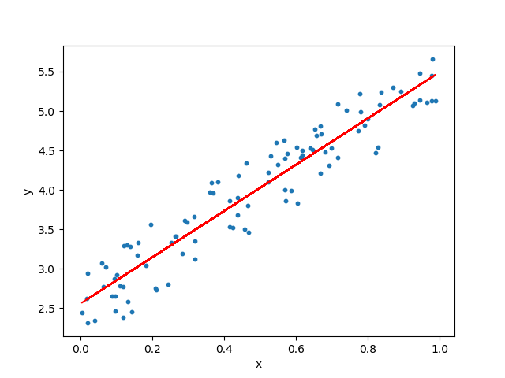

# Linear Regression model
Creating Linear Regression Model from Scratch

Linear Regression is a method used to define a relationship between a dependent variable (Y) and independent variable (X).

Which is simply written as :-

>**y = mx + b**

>Where y is the dependent variable, m is the scale factor or coefficient, b being the bias coefficient and X being the independent variable.

The bias coefficient gives an extra degree of freedom to this model. The goal is to draw the line of best fit between X and Y which estimates the relationship between X and Y.

But how do we find these coefficients, We can find these using different approaches. One is the Ordinary Least Mean Square Method approach and the Gradient Descent approach. 

We will be implementing both the approaches here

This repository is to implement linear regression algorithm without the use of scikit-learn python library.

